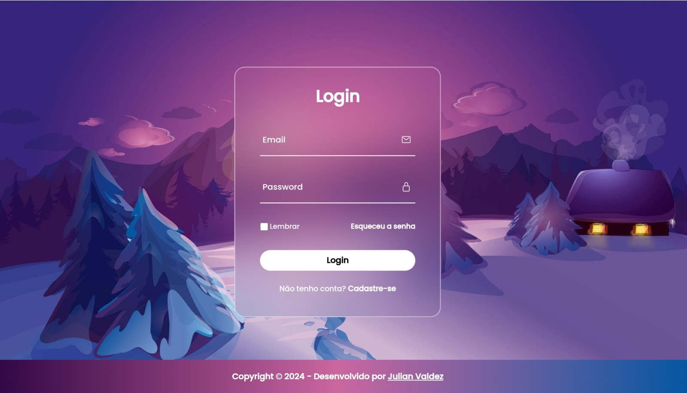
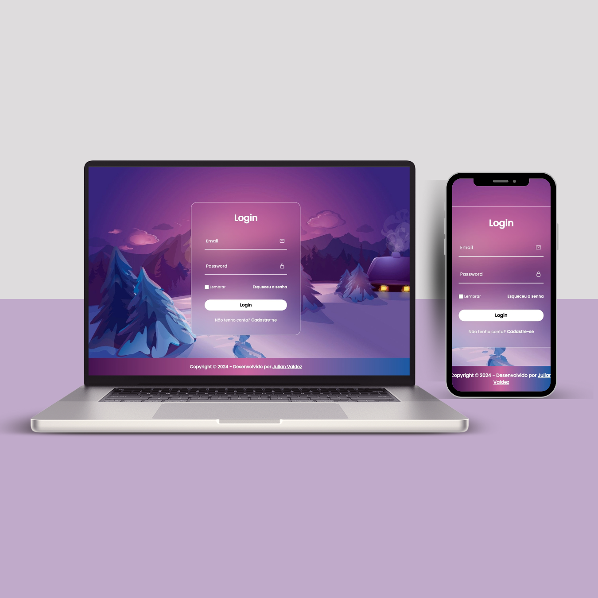

<h1>🖥 Login Form</h1>

Bem-vindo ao projeto de uma página de login responsiva com design moderno e efeito Glassmorphism. 
  Esta é uma jornada visualmente cativante, que busca proporcionar uma experiência de usuário única e agradável durante o processo de login. 
  O projeto foi desenvolvido focando em elementos interativos e redução de erros em tempo real.

 
🔗 <a href="https://first-login-form.vercel.app/">Clique aqui para acessar o projeto</a> 
 

 
<h2>• Tecnologias utilizadas para a construção da aplicação:</h2>
 

 
<h3>Recursos Únicos:</h3>
•<b> Efeito Glassmorphism:</b>

O design do projeto incorpora o popular efeito Glassmorphism, proporcionando uma aparência moderna e translúcida aos elementos da interface.

•<b> Cores Vibrantes:</b>

Paleta de cores vibrantes e atraentes que não apenas tornam a página esteticamente agradável, mas também criam uma atmosfera positiva para os usuários.

Desenvolvimento pensando em dispositivos de diferentes tamanhos, garantindo uma experiência consistente e agradável em telas de computadores, tablets e smartphones.

 

 
 

